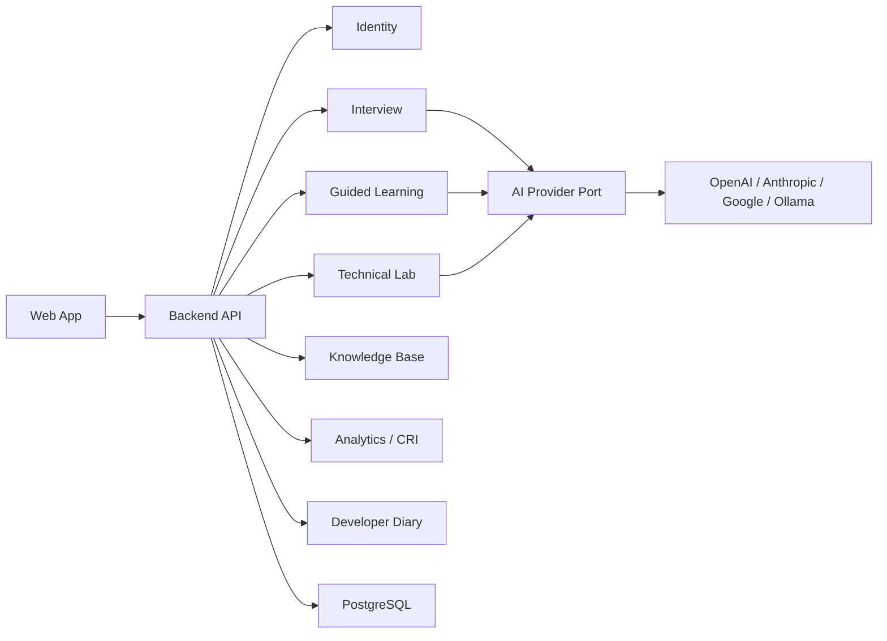

# Architecture Modules

## Overview

The application is a modular monolith organized around product domains. Each module owns its domain model, application services, persistence port and API surface.

## Identity

Owns personal user identity, authentication, password/session handling and route protection.

## Interview

Owns interview session setup, questions, answers, session state and completion.

## Guided Learning

Owns help levels, retry flow, model answers, vocabulary guidance and concept tracking.

## Technical Lab

Owns challenge catalog, attempts, evaluation criteria, controlled solution reveal and feedback records.

## Knowledge Base

Owns saved questions, answers, notes, flashcards, checklists, links and searchable history.

## Analytics / CRI

Owns Career Readiness Index, evidence confidence, trends, score composition and gaps.

## Developer Diary

Owns ADRs, changelog, learning journal, implementation notes and future improvements.

## AI Provider

Owns provider-independent request/response contracts. Concrete adapters implement OpenAI, Anthropic, Google or local models later.

